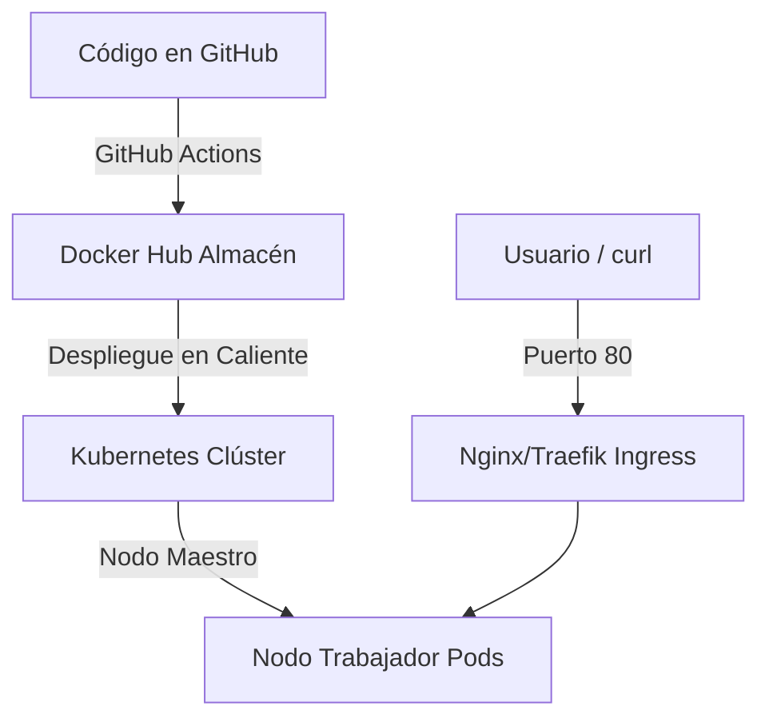

# 🚀 Plataforma de Despliegue GitOps y Orquestación Multinodo

Este proyecto demuestra habilidades avanzadas de ingeniería DevOps mediante el diseño e implementación de un ciclo de vida completo de entrega continua (CI/CD), automatización de infraestructura y orquestación de contenedores en alta disponibilidad, utilizando herramientas de código abierto.

## 🗺️ Arquitectura del Sistema



---

## 🛠️ Stack Tecnológico Utilizado

*   **Aplicación Base:** Python 3.11 con FastAPI y Uvicorn (servidor asíncrono).
*   **Contenedores:** Docker utilizando *Multi-stage builds* y principios de mínimos privilegios (ejecución sin root).
*   **Automatización CI/CD:** GitHub Actions conectado de forma segura a Docker Hub mediante *Repository Secrets*.
*   **Infraestructura como Código (IaC):** Terraform para el aprovisionamiento de Redes Virtuales (VCN) en Oracle Cloud Infrastructure (OCI).
*   **Gestión de Configuración:** Ansible mediante Playbooks YAML estructurados e idempotentes para la provisión de nodos Linux.
*   **Orquestación:** Clúster multinodo de Kubernetes (K3s/K3d) con políticas de *Rolling Update* y enrutamiento mediante *Ingress Controller*.

---

## 📂 Estructura del Repositorio

```text
├── .github/workflows/
│   └── ci-pipeline.yml     # Pipeline de automatización en GitHub Actions
├── ansible/
│   ├── inventory.ini       # Inventario de servidores objetivo
│   ├── preparar_nodos.yml  # Playbook de actualización y paquetería base
│   └── instalar_k3s.yml    # Playbook de instalación del runtime de Kubernetes
├── infraestructura/
│   ├── providers.tf        # Configuración del proveedor de Oracle Cloud
│   ├── network.tf          # Diseño de Red Virtual (VCN) y subredes públicas
│   └── compute.tf          # Planificación de instancias de cómputo en la nube
├── k8s/
│   ├── k8s-despliegue.yaml # Definición de Deployment (2 Replicas) y Service
│   └── k8s-ingress.yaml    # Configuración del Ingress Controller para tráfico web
├── Dockerfile              # Receta de empaquetado optimizada para Python
├── main.py                 # Código fuente de la API en Python (FastAPI)
├── requirements.txt        # Dependencias del proyecto Python
└── .gitignore              # Protección del repositorio contra binarios pesados
```

---

## 🚀 Guía de Despliegue y Ejecución

### 1. Construcción Local y Docker
Para empaquetar y validar la aplicación de forma aislada en local:
```bash
docker build -t api-devops-python:v1 .
docker run -d -p 8000:8000 --name api-local api-devops-python:v1
curl http://localhost:8000
```

### 2. Automatización CI/CD (GitHub Actions)
El archivo `.github/workflows/ci-pipeline.yml` se dispara automáticamente con cada `git push` a la rama `main`. Ejecuta los siguientes pasos en runners en la nube:
1. Descarga del código fuente.
2. Configuración del entorno Docker Buildx.
3. Autenticación segura en Docker Hub mediante variables cifradas de entorno.
4. Construcción y empuje de la imagen Docker final con el tag `latest`.

### 3. Aprovisionamiento Cloud (Terraform)
Ubicado en la carpeta `infraestructura/`. Permite levantar la red perimetral de seguridad en la nube de Oracle (Madrid):
```bash
terraform init
terraform plan
terraform apply -auto-approve
```

### 4. Orquestación Automática (Ansible)
Ubicado en la carpeta `ansible/`. Automatiza la preparación de las máquinas virtuales y la instalación base del clúster de Kubernetes:
```bash
ansible-playbook -i inventory.ini preparar_nodos.yml
```

### 5. Operación en Kubernetes
El clúster ejecuta **dos réplicas** de la aplicación en estado de alta disponibilidad. Los comandos de despliegue y control de tráfico utilizados son:
```bash
# Aplicar manifiestos de aplicación y enrutamiento
kubectl apply -f k8s/k8s-despliegue.yaml
kubectl apply -f k8s/k8s-ingress.yaml

# Comprobar el estado de los nodos del clúster y los Pods
kubectl get nodes
kubectl get pods

# Simular actualización en producción sin caída de servicio (Zero-Downtime)
kubectl rollout restart deployment/api-python-deployment
```

---

## 🔍 Habilidades Demostradas en este Proyecto

1.  **GitOps & CI/CD Avanzado:** Automatización total de la integración de software separando el código fuente del artefacto final compilado.
2.  **Idempotencia con Ansible:** Provisión de software asegurando que el estado del servidor final sea predecible sin importar cuántas veces se ejecute el Playbook.
3.  **Conceptos Clave de Redes:** Gestión de direccionamiento CIDR, tablas de enrutamiento, mapeo de puertos de contenedores y proxies inversos de capa 7 (Ingress).
4.  **Resiliencia y Alta Disponibilidad:** Orquestación en Kubernetes configurando autorreparación (*self-healing*) de contenedores y balanceo de carga nativo.
5.  **Resolución de Problemas (Troubleshooting):** Capacidad de adaptación técnica ante problemas de stock en la nube pública (*Out of Capacity*) migrando de forma ágil a entornos locales simulados mediante contenedores.

---
👨‍💻 **Desarrollado y mantenido por Marcos**
